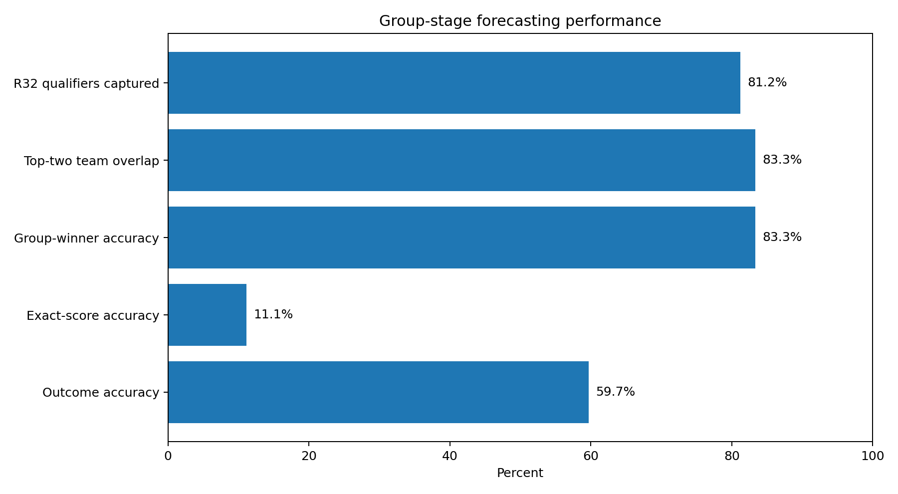
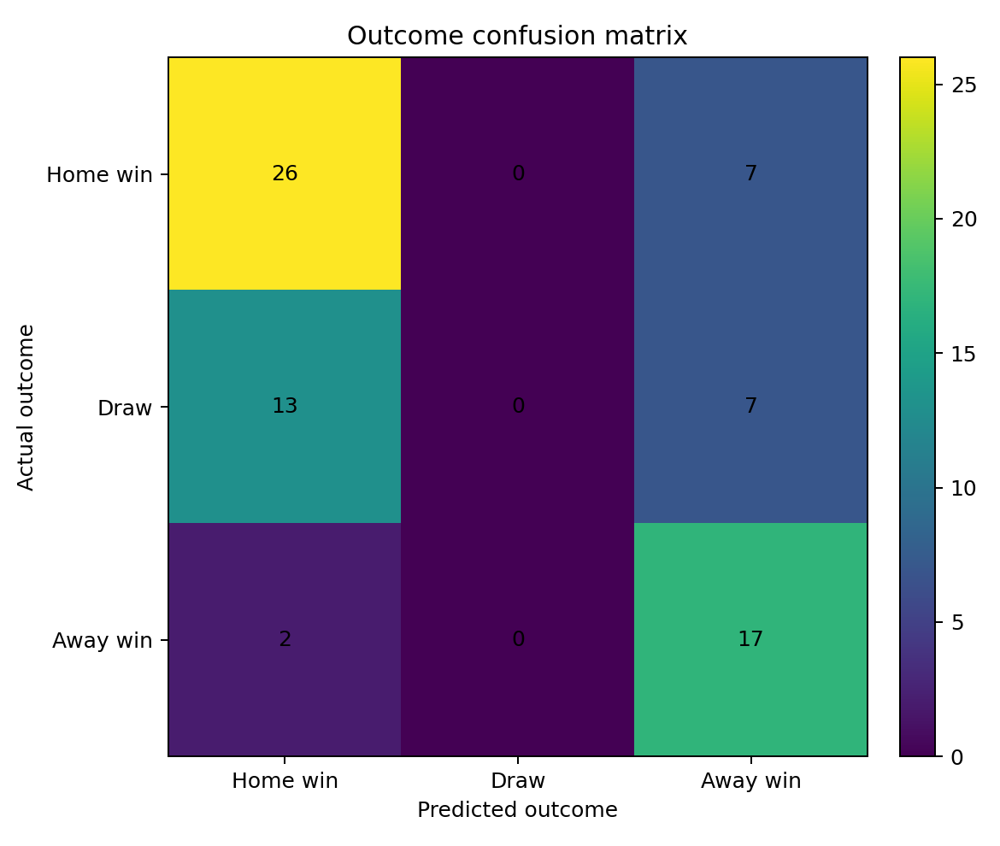
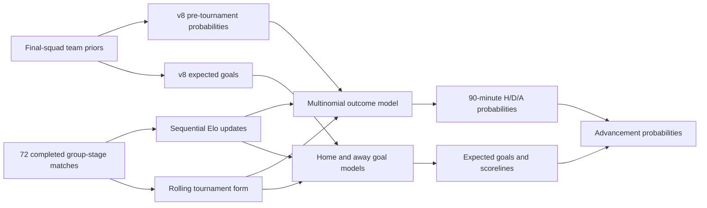
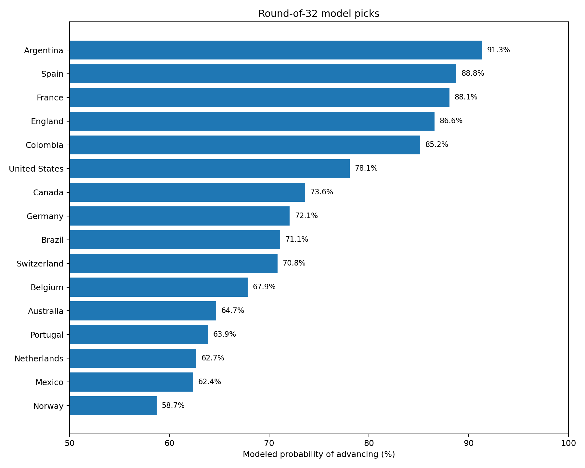

<p align="center">
  
</p>

<h1 align="center">FIFA World Cup 2026 Forecasting</h1>

<p align="center">
  <strong>Roster-aware pre-tournament predictions, group-stage evaluation, and tournament-updated Round-of-32 forecasts.</strong>
</p>

<p align="center">
  
  
  
  
</p>

---

## Overview

This repository contains the complete **SambaSportAI FIFA World Cup 2026 prediction project** used to:

1. produce roster-aware pre-tournament group-stage forecasts;
2. evaluate those forecasts after all 72 group matches;
3. construct leakage-controlled in-tournament form features;
4. retrain regularized outcome and score models;
5. generate Round-of-32 match and advancement probabilities;
6. present the results through interactive browser-based dashboards.

The project separates two modeling stages:

- **v8 — final-squad pre-tournament baseline:** frozen probabilities, expected goals, group advancement estimates, and team-rating priors;
- **v9 — tournament update:** retrained after the group stage using only information available through **June 27, 2026**.

> **No Round-of-32 result is used in the v9 training or prediction pipeline.**

---

## Headline results

| Metric | Result |
|---|---:|
| Group-stage matches evaluated | **72** |
| Correct win/draw/loss predictions | **43/72** |
| Outcome accuracy | **59.7%** |
| Log loss | **0.880** |
| Multiclass Brier score | **0.521** |
| Exact-score accuracy | **11.1%** |
| Group winners correctly predicted | **10/12** |
| Top-two teams correctly identified | **20/24** |
| Round-of-32 qualifiers captured | **26/32** |

<p align="center">
  
</p>

The strongest part of the project was tournament-level ranking: **83.3% of group winners** and **81.3% of Round-of-32 qualifiers** were identified. The main weakness was the draw decision rule: the model assigned draw probability, but a draw was never the highest-probability class.

<p align="center">
  
</p>

---

## Modeling pipeline



### Outcome model

The v9 outcome model is:

```text
StandardScaler
    + regularized multinomial LogisticRegression
```

Features include:

- frozen v8 win/draw/loss probabilities;
- frozen v8 expected goals;
- pre-match dynamic Elo difference;
- rolling tournament points per game;
- rolling goals scored and conceded;
- matches already played in the tournament;
- host-team indicator.

### Score models

Home and away goals are modeled separately using:

```text
StandardScaler
    + Ridge regression on log1p(goals)
```

The resulting rates are calibrated to the group-stage scoring environment and converted into exact-score probabilities with a Poisson layer.

### Validation

The tournament-update model uses **six-fold group-held-out validation**. Every fold withholds two complete groups, reducing leakage from closely related group-stage matches.

Packaged validation results:

- outcome accuracy: **47.2%**
- log loss: **0.940**
- per-team goal MAE: **1.02**

These validation results are intentionally conservative because the update contains only 72 tournament matches.

---

## Round-of-32 output sample

The probabilities below refer to the result after **90 minutes**. The advancement probability also accounts for a possible draw, extra time, and penalties through a strength-weighted approximation.

| Match | 90-minute H / D / A | Expected score | Most likely score | Pick to advance |
|---|---:|---:|---:|---:|
| South Africa vs Canada | 19.5% / 19.6% / 61.0% | 1-2 | 0-1 | **Canada** (73.6%) |
| Germany vs Paraguay | 54.3% / 28.3% / 17.4% | 2-1 | 1-1 | **Germany** (72.1%) |
| Brazil vs Japan | 52.0% / 30.8% / 17.2% | 2-1 | 1-1 | **Brazil** (71.1%) |
| Netherlands vs Morocco | 47.0% / 28.5% / 24.5% | 2-1 | 1-1 | **Netherlands** (62.7%) |
| Ivory Coast vs Norway | 32.8% / 24.1% / 43.1% | 1-1 | 1-1 | **Norway** (58.7%) |
| France vs Sweden | 62.4% / 30.6% / 6.9% | 2-1 | 1-0 | **France** (88.1%) |

<p align="center">
  
</p>

The complete output is available in:

```text
outputs/predictions/round_of_32_predictions.csv
```

---

## Interactive dashboards

### Group-stage review and Round-of-32 predictions

Open:

```text
ui/group_stage_review_and_round32_predictions.html
```

It contains:

- headline evaluation metrics;
- Round-of-32 match cards;
- 90-minute probabilities;
- advancement probabilities;
- expected and most likely scores;
- group-stage form context;
- match-by-match prediction audit.

### Pre-tournament dashboards

The repository also preserves:

- `ui/pre_tournament_prediction_center.html`
- `ui/group_stage_matchday_1.html`
- `ui/group_stage_matchday_2.html`
- `ui/group_stage_matchday_3.html`

Serve all UIs locally with:

```bash
python -m http.server 8000 --directory ui
```

Then open:

```text
http://localhost:8000
```

The repository also includes a GitHub Pages workflow and a UI landing page at `ui/index.html`. See [`docs/GITHUB_SETUP.md`](docs/GITHUB_SETUP.md).

---

## Repository structure

```text
sambasportai-world-cup-2026/
├── configs/              # Hyperparameters and modeling configuration
├── data/
│   ├── baseline/         # Frozen v8 predictions and team priors
│   ├── raw/              # Group-stage scores and R32 fixtures
│   ├── processed/        # Leakage-controlled training features
│   └── manifest/         # Data provenance and licensing notes
├── models/
│   ├── v8/               # Frozen roster-aware checkpoints
│   └── v9/               # Tournament-update checkpoints
├── outputs/
│   ├── evaluation/       # Group-stage audit and metrics
│   ├── form/             # Final group-stage team form
│   └── predictions/      # Round-of-32 predictions
├── reports/              # Model cards, provenance, CV, methodology
├── scripts/              # Reproducible command-line workflow
├── src/                  # Reusable Python package
├── tests/                # Data and checkpoint integrity tests
├── ui/                   # Browser-based deliverables
└── docs/                 # Figures and output examples
```

A more detailed tree is available in [`docs/REPOSITORY_STRUCTURE.md`](docs/REPOSITORY_STRUCTURE.md).

---

## Quick start

### 1. Clone the repository

```bash
git clone https://github.com/areyesan/sambasportai-world-cup-2026.git
cd sambasportai-world-cup-2026
```

### 2. Create an environment

#### Linux or macOS

```bash
python3 -m venv .venv
source .venv/bin/activate
```

#### Windows PowerShell

```powershell
py -3.11 -m venv .venv
.\.venv\Scripts\Activate.ps1
```

### 3. Install

```bash
python -m pip install --upgrade pip
pip install -e ".[dev]"
```

### 4. Run the complete workflow

```bash
python scripts/run_pipeline.py --stage all
```

Or:

```bash
make pipeline
```

The pipeline executes:

1. evaluation of the 72 frozen group-stage predictions;
2. sequential Elo and rolling-form feature construction;
3. model retraining;
4. Round-of-32 prediction;
5. repository integrity validation.

---

## Run individual stages

```bash
python scripts/evaluate_group_stage.py
python scripts/build_tournament_features.py
python scripts/train_tournament_update.py
python scripts/predict_round32.py
python scripts/validate_repository.py
pytest -q
```

### Common Make targets

```bash
make evaluate
make features
make train
make predict
make validate
make test
make serve-ui
```

---

## Main files

### Inputs

| File | Description |
|---|---|
| `data/baseline/v8_match_predictions.csv` | Frozen pre-tournament match probabilities and expected goals |
| `data/baseline/v8_group_advancement.csv` | Group winner, top-two, and advancement probabilities |
| `data/baseline/v8_final26_team_ratings.csv` | Roster-aware team priors |
| `data/raw/world_cup_2026_group_stage_results.csv` | All 72 completed group-stage results |
| `data/raw/round_of_32_fixtures.csv` | Knockout fixtures scored by v9 |

### Outputs

| File | Description |
|---|---|
| `outputs/evaluation/group_stage_evaluation_metrics.json` | Complete evaluation metric set |
| `outputs/evaluation/group_stage_prediction_vs_actual.csv` | Match-by-match audit |
| `outputs/form/team_form_after_group_stage.csv` | Elo, points, GF, GA, and per-game form |
| `outputs/predictions/round_of_32_predictions.csv` | 90-minute and advancement predictions |

### Checkpoints

| File | Description |
|---|---|
| `models/v9/v9_outcome_model.joblib` | Multinomial outcome model |
| `models/v9/v9_score_models.joblib` | Home and away goal models |
| `models/v8/` | Preserved upstream roster-aware checkpoints |

---

## Metrics

### Accuracy

Fraction of matches where the highest-probability outcome matches the observed result.

### Log loss

Evaluates the full probability distribution. Confident incorrect predictions receive a larger penalty.

### Multiclass Brier score

Mean squared error between predicted class probabilities and the one-hot observed outcome.

### Ranked Probability Score

A probability score that respects the ordering of home win, draw, and away win.

### Exact-score accuracy

Fraction of matches where the single most likely scoreline exactly matches the final result.

### Expected score vs. most likely score

- **Expected score:** rounded expected goals for each team.
- **Most likely score:** the single exact scoreline with the largest Poisson probability.

These values can differ because an average does not have to be the mode of a discrete distribution.

---

## Data provenance and licensing

See:

- [`data/manifest/data_sources_manifest.csv`](data/manifest/data_sources_manifest.csv)
- [`reports/DATA_PROVENANCE.md`](reports/DATA_PROVENANCE.md)

The repository does **not** include proprietary live player-minute feeds, paid market-value databases, private scouting data, or authentication credentials. Third-party source material remains governed by its original terms.

---

## Limitations

- The tournament update has only 72 new observations.
- Draws were under-selected as the highest-probability class.
- Exact-score forecasting remains substantially harder than result forecasting.
- The extra-time and penalty model is an approximation.
- Roster information is represented through frozen team-level priors rather than a bundled licensed live player feed.
- Predictions reflect the stated information cutoff and should be retrained as new results become available.
- This project is for research and sports-analytics demonstration, not betting or financial advice.

---

## Documentation

- [`reports/GROUP_STAGE_EVALUATION_AND_R32.md`](reports/GROUP_STAGE_EVALUATION_AND_R32.md)
- [`reports/MODEL_CARD_v8.md`](reports/MODEL_CARD_v8.md)
- [`reports/MODEL_CARD_v9.md`](reports/MODEL_CARD_v9.md)
- [`reports/REPRODUCIBILITY.md`](reports/REPRODUCIBILITY.md)
- [`docs/OUTPUT_SAMPLES.md`](docs/OUTPUT_SAMPLES.md)
- [`CHANGELOG.md`](CHANGELOG.md)

---

## Citation

```bibtex
@software{reyesangulo2026sambasportai,
  author  = {Reyes-Angulo, Abel A.},
  title   = {SambaSportAI FIFA World Cup 2026 Forecasting},
  year    = {2026},
  version = {0.9.0},
  url     = {https://github.com/areyesan/sambasportai-world-cup-2026}
}
```

A machine-readable citation is available in [`CITATION.cff`](CITATION.cff).

---

## Contact

**Abel A. Reyes-Angulo**  
SambaSportAI  
GitHub: [@areyesan](https://github.com/areyesan)

---

<p align="center">
  Built for transparent, reproducible, and explainable football analytics.
</p>
